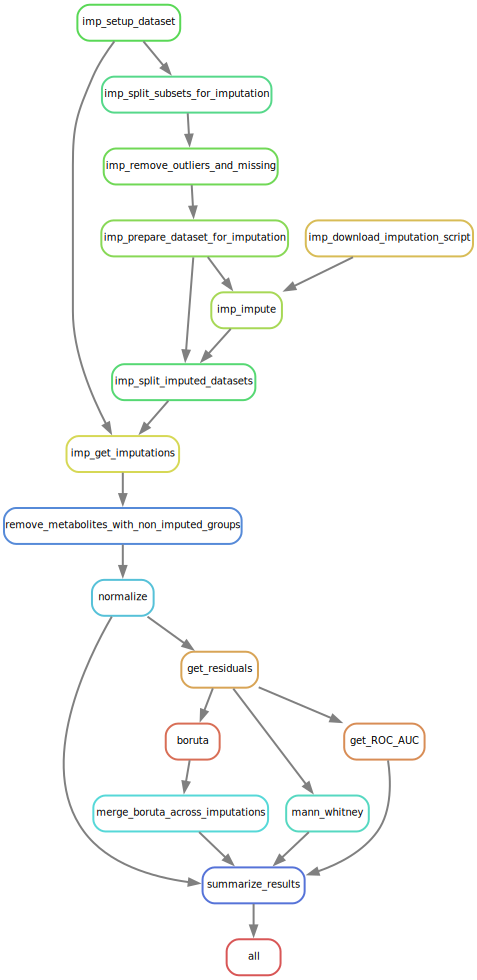

# Metabolomics base workflow

This repository contains a Snakemake pipeline to conduct metabolomics data analysis comparing two groups of samples in a robust manner, handling the random component on every step of the analysis.
Most of the code to handle the metabolomics datasets is based on the `metabotk` python library (available at https://github.com/matteobolner/metabotk).
Variants of this pipeline have been used to analyze metabolomics data in the following publications:  
* [High-throughput untargeted metabolomics reveals metabolites and metabolic pathways that differentiate two divergent pig breeds (Published)](https://doi.org/10.1016/j.animal.2024.101393)
* Description of metabolic differences between castrated males and intact gilts obtained from
high-throughput metabolomics of porcine plasma (Accepted for publication)
## Usage
Edit the config.yaml file to define the dataset and analysis parameters.
The metabolomics dataset must be in excel format and contain the following sheets:
* Sample metadata 
* Chemical annotation (metabolite metadata)
* Metabolite abundance data

## Pipeline structure
The summarized structure of this pipeline can be seen below (rulegraph.svg).
For the full pipeline including the repeated steps to account for multiple random seeds, see dag.svg

* Missing data imputation
    + Remove outlier values and samples/metabolites with too many missing values (> 25% by default)
    + Impute missing values with MICE predictive mean matching (pmm)
* Normalization (optional)
* Removal of confounding effects (OLS regression)
* Feature selection 
    * Boruta (Random Forest)
* Differential metabolite analysis
    * Univariate analyses (Mann-Whitney, ROC AUC)
    * Multivariate analyses (Correlation networks) - not added to this repo yet

## Citation
If you use this workflow and want to cite it, you can cite our paper:
[High-throughput untargeted metabolomics reveals metabolites and metabolic pathways that differentiate two divergent pig breeds](https://doi.org/10.1016/j.animal.2024.101393)
